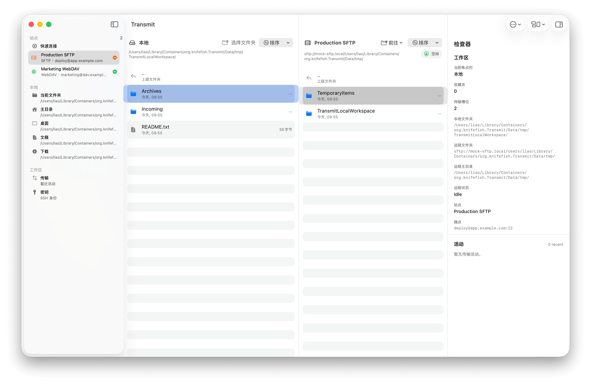
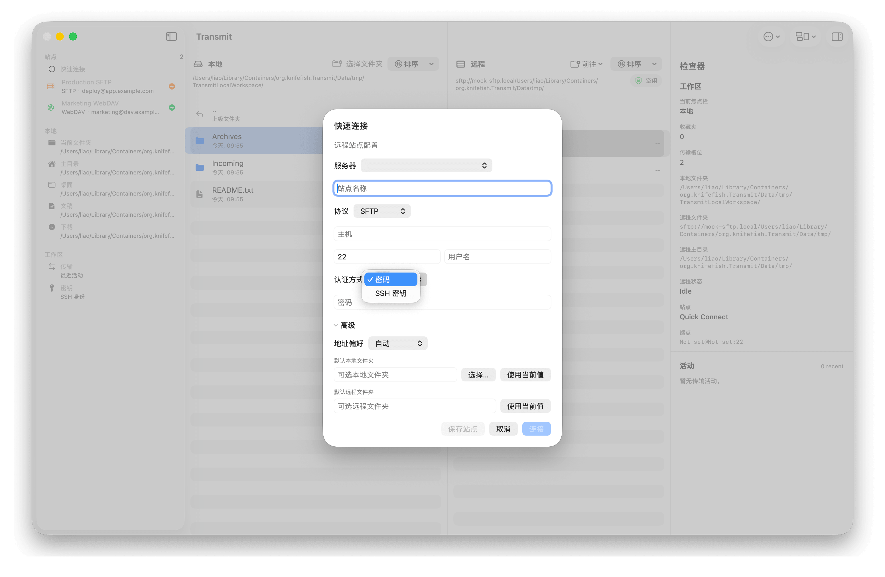

# Transmit

macOS file transfer client, designed to support SFTP, WebDAV, and S3-compatible modes.

SFTP support for both passwords and keys has already been implemented. WebDAV and S3-compatible modes are currently under active development.

We’d like to thank Transmit 5 for the inspiration; this project has no commercial affiliation with Transmit 5.

We’d also like to acknowledge all the third-party libraries used in this project!

<details>
<summary>Screenshot</summary>



</details>

## Goal

- Native-feeling dual-pane file browser
- Real local and remote file operations
- Transfer queue and activity tracking
- Saved servers, favorites, and inspector workflows
- A Swift-first architecture that can grow into a full desktop app

## Product Principles

- Build the desktop interaction model first: selection, keyboard flow, drag and drop, split views, sidebars, inspector
- Keep protocol implementations behind a unified domain layer
- Prioritize one strong remote protocol before expanding sideways
- Use SwiftUI for composition, but allow AppKit bridging where macOS interaction fidelity requires it
- Ship vertical slices instead of broad unfinished feature surfaces

## Proposed Architecture

The app should trend toward this layout:

```text
Transmit/
  App/
  Models/
  Views/
  Services/
    LocalFileSystem/
    RemoteProtocols/
    Transfers/
    Persistence/
  Support/
```

Guidelines:

- `Models`: domain and presentation state
- `Views`: SwiftUI screens and reusable UI pieces
- `Services`: side effects, filesystem access, protocol adapters, persistence
- `Support`: shared utilities, formatters, constants

## Technology Stack

- Swift
- SwiftUI
- AppKit bridging where desktop UX requires it
- Swift Testing
